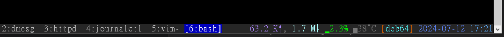
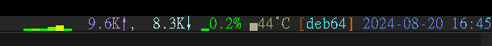

This is my simple tmux config file for you to modify, with some simple indicator supports, use these variable in your status_left or status_right

1. mouse indicator: #{indicator_mouse}
2. simple mode indicator: **${indicator_mode}** (not #{indicator_mode}), you can change to your own style in config file
3. CPU temperature: **#{indicator_cpuTemperature}** require lm-sensors installed
4. devices support hwmon temperature: **#{indicator_hwmon?}** to calculate average temperature for a device.
   - check your /sys/class/hwmon/hwmon*/name for supported devices.
   - for example, your nvme ssd is hwmon1, use **#{indicator_hwmon1}**
6. CPU usage: **#{indicator_cpuUsage}**
7. network speed: **#{indicator_netspeed_???}** to show your network speed history.
   - for example, my interface is br0, i will use **#{indicator_netspeed_br0}** to show.
   
